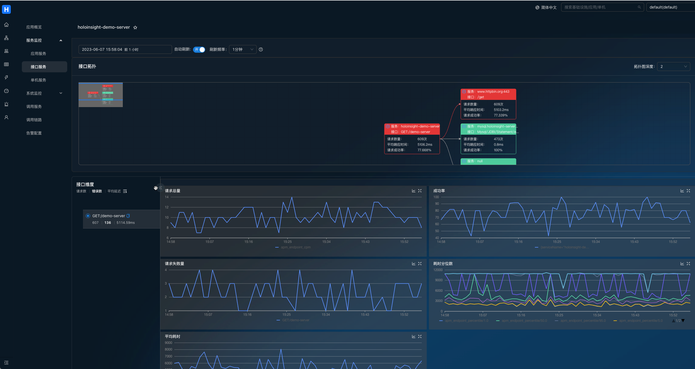

# 介绍

本文介绍基于 Helm 的方式部署 HoloInsight 以及 HoloInsight Agent。


你需要准备的：

- [K8s](https://kubernetes.io/) 的基本知识
- [Helm v3](https://helm.sh/) 的基本知识
- 一个 K8s 集群（规格 > 4G8G），推荐使用 [K3s](https://docs.k3s.io/) 来练习
- Linux 或 Mac 的开发环境
- Git

# 部署 HoloInsight

注意，本例子中，数据库的部分也会被该Helm Chart一起部署，但它们是不可靠的，没有使用任何高可用方案以及持久化存储，这意味着一旦重新部署，你将丢失所有数据。
在生产级的实践中，需要你准备好这 4 种数据库（手动部署或者购买云厂商提供的服务），并且做到生产级高可用。

在 `holoinsight-server` 命名空间 **升级或安装(更新)** 最新版本的 HoloInsight：

```bash
# Add holoinsight repository
helm repo add holoinsight https://holoinsight.github.io/holoinsight-helm-charts/

kubectl create namespace holoinsight-server
helm -n holoinsight-server upgrade --install holoinsight holoinsight/holoinsight
```

如果你想安装特定版本：
```bash
helm -n holoinsight-server upgrade --install --version 1.0.0 holoinsight holoinsight/holoinsight
```

等待所有 Pods 处于 **Ready** 状态。你可以使用如下命令可视化地观察进度：

```bash
kubectl -n holoinsight-server get pods -w
```

例子输出：
```text
$ kubectl -n holoinsight-server get pods -w
NAME                                      READY   STATUS    RESTARTS   AGE
holoinsight-mongo-0                       1/1     Running   0          100s
holoinsight-mysql-0                       1/1     Running   0          100s
holoinsight-collector-5c5946df87-s24qm    1/1     Running   0          100s
holoinsight-collector-5c5946df87-wtw4g    1/1     Running   0          100s
holoinsight-prometheus-69795584d6-8fljk   1/1     Running   0          100s
holoinsight-es-0                          1/1     Running   0          100s
holoinsight-ceresdb-0                     1/1     Running   0          100s
holoinsight-server-0                      1/1     Running   0          100s
```

## 初始化 HoloInsight
**首次部署时**，需要对 HoloInsight 做一些初始化。非首次部署可以跳过该步骤。
当前产品层缺少初始化引导页面，故需要通过脚本方式进行始化，它做了如下事情：

1. 添加一个租户叫做 "default"，配置其存储使用 CeresDB
2. 添加一个 apikey "default"
3. 录入 JVM 插件
4. 录入应用监控左侧菜单配置

```bash
git clone https://github.com/traas-stack/holoinsight-helm-charts

# 某些脚本的行为依赖特定的版本，如果你刚安装的 HoloInsight 不是最新版，
# 建议你使用 git checkout holoinsight-1.0.0 切换到对应的版本。
./scripts/holoinsight/init.sh
```

输出样例：
```text
[database] wait for [holoinsight-mysql] to be ready
partitioned roll out complete: 1 new pods have been updated...

[database] wait for [holoinsight-server] to be ready
partitioned roll out complete: 1 new pods have been updated...

[database] populate init data
mysql: [Warning] Using a password on the command line interface can be insecure.
done
```

## 访问产品层页面
在生产级的实践中，你需要手动创建 [Ingress](https://kubernetes.io/zh-cn/docs/concepts/services-networking/ingress/) 并且暴露为域名。
> 通常 Ingress 的配置依赖具体的部署环境，故没有在本 Helm Chart 里提供。

这里提供的页面访问方式仅能用于测试阶段。

将 HoloInsight 80 端口映射到本地 8080 端口：
```bash
./scripts/server-port-forward.sh
```

输出样例：
```text
Visit HoloInsight at http://localhost:8080
Forwarding from 127.0.0.1:8080 -> 80
Forwarding from [::1]:8080 -> 80
Handling connection for 8080
```

访问 http://localhost:8080 即可。

## 定制 HoloInsight
比如修改镜像版本，且增大容器规格。具体支持哪些定制请参考 Chart 内容。
创建一个新文件 values.yaml
```yaml
server:
  image: holoinsight/server:ANOTHER_TAG
  resources:
    requests:
      cpu: "4"
      memory: "8Gi"
    limits:
      cpu: "4"
      memory: "8Gi"
# applicationYaml: override application.yaml of Spring Boot
```

更多配置查看 [server-bootstrap-configuration](../../../dev-guide/run/server-bootstrap-configuration.html)。

执行如下命令进行安装或升级(更新)：
```yaml
helm -n holoinsight-server upgrade --install holoinsight -f values.yaml
```

## 查看部署情况
```bash
helm -n holoinsight-server list
```

## 卸载 HoloInsight
```bash
helm -n holoinsight-server uninstall holoinsight
```

# 部署 HoloInsight Agent

编辑 values.yaml

```yaml
apikey: "default"
common_version: '1'
workspace: "default"
cluster: "default"

server:
  registry:
    addr: registry.holoinsight-server:7202
  gateway:
    addr: gateway.holoinsight-server:19610
  secure: false

# 如果你使用的是 containerd 或 k3s+containerd，你应该将 containerd 的 run 目录挂载到 cadvisor.
# 如下是 k3s+containerd 场景的配置：
#cadvisor:
#  volumes:
#  - name: containerd
#    hostPath:
#      path: /run/k3s/containerd
#  volumeMounts:
#  - name: containerd
#    mountPath: /run/containerd
#    readOnly: true
```
更多配置查看 [agent-bootstrap-configuration](../../../dev-guide/run/agent-bootstrap-configuration.html)。

在 holoinsight-agent 命名空间里安装或升级(更新) HoloInsight-Agent：
```bash
kubectl create namespace holoinsight-agent
helm -n holoinsight-agent upgrade --install holoinsight-agent holoinsight/holoinsight-agent -f values.yaml 
```

## 卸载 HoloInsight-Agent
```bash
```bash
helm -n holoinsight-agent uninstall holoinsight-agent
```

# 安装示例应用
在探索 HoloInsight 之前，推荐安装 2 个实例应用到 K8s 集群里。让它们产生一些调用流量，提升 HoloInsight 上的展示效果。

```bash
kubectl apply -f https://github.com/traas-stack/holoinsight-helm-charts/blob/main/scripts/holoinsight/demo.yaml
```

# 初次探索 HoloInsight
打开`机器列表`页面，展示了所有 Pods 的信息。

> 如果 CPU 和 MEM 列是空的，可能是才刚安装完不就，没有数据，此时需要等待 1~2 分钟。

点击旁边的`查看`按钮，服务端会利用 Server 与 Agent 之间的长连接发起一个反向请求查询该 Pod 的一些基本信息。
如果该页面可以正常显示，说明 Server 与该 Pod 的 Agent 之间的通信链路是正常的。

> 之后介绍的 "浏览目录", "浏览日志" 功能也是通过该反向连接实现的。

打开应用监控。
服务端会从所有 Pods 里提取出 App 元信息（这是由一个定时任务驱动的，如果没有看到数据，请再等待 1~2 分钟）。
默认情况下 Pod 的 `app` 或 `app.kubernetes.io/name` 标签会被识别为应用名。


> 如果应用接入了 SkyWalking agent 并且上报到 holoinsight-collector，此时页面会显示"平均数" "错误率" "平均响应时间"这3个字段的值，如 holoinsight-demo-server。

查看 Pod 系统指标：


查看应用的 JVM 指标：


搜索链路：


查看链路详情：


查看基于链路的服务指标：

