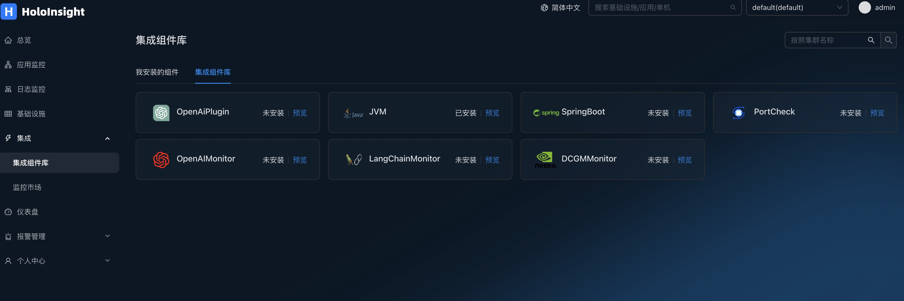
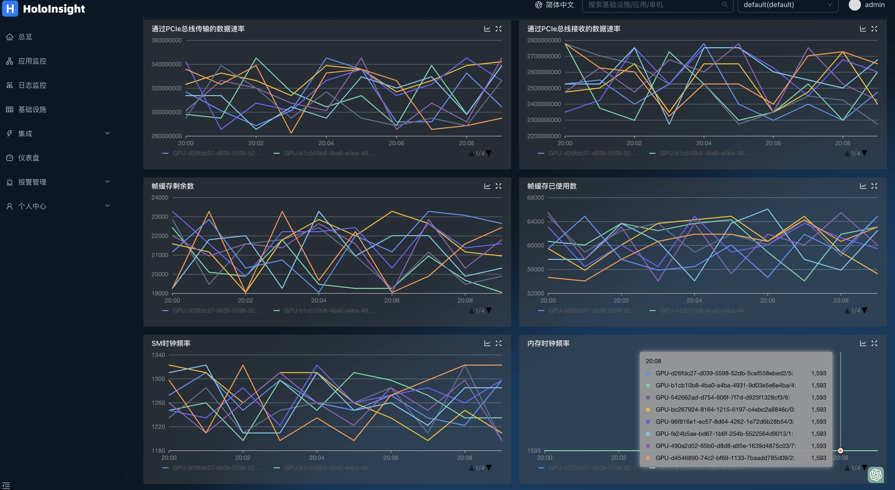
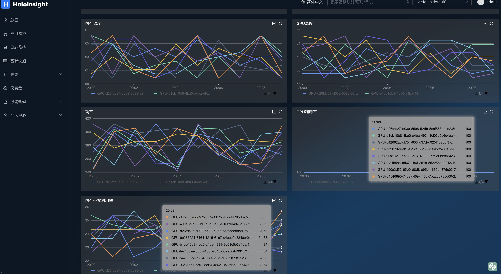

# dcgmMonitor 插件
在您GPU机器上部署k8s环境，并且安装dcgm-exporter和Holoinsight-agent，具体安装方法见文档

[**dcgm-exporter**](https://github.com/NVIDIA/dcgm-exporter#quickstart-on-kubernetes)

[**holoinsight-agent**](https://traas-stack.github.io/holoinsight-docs/en/operations/deployment/k8s.html#deploy-holoinsight-agent)

安装好之后默认会采集GPU数据 
打开页面 http://localhost:8080/integration/agentComp?tenant=default.

在集成组件页面安装DCGMMonitor插件

点击预览

可以自动生成dcgm监控仪表盘，监控GPU信息

