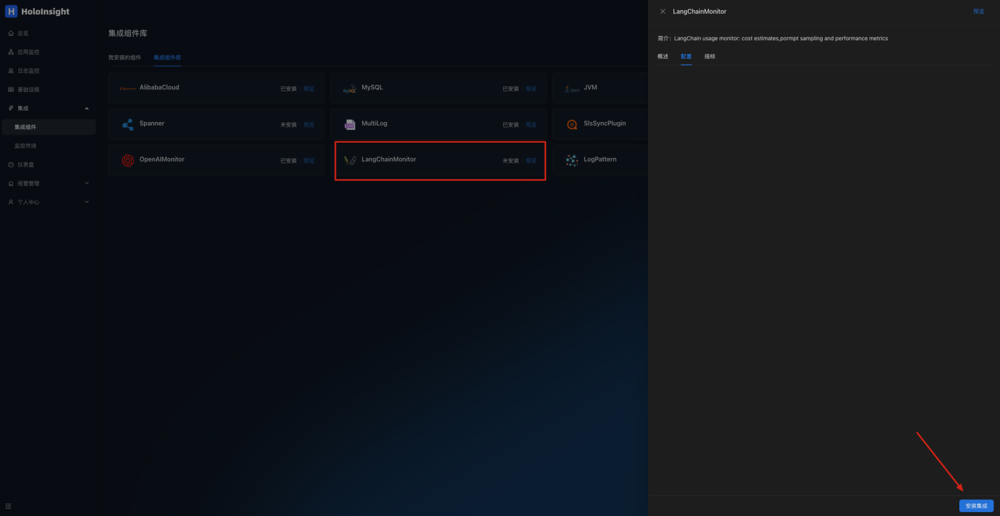
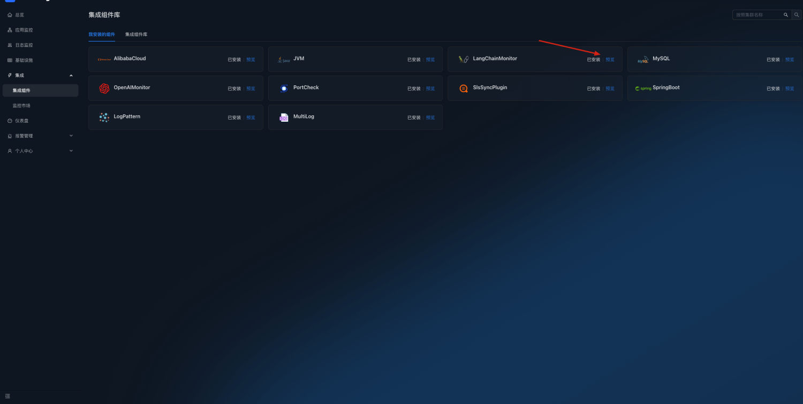
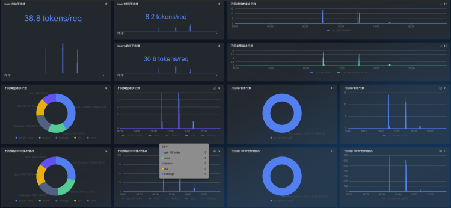
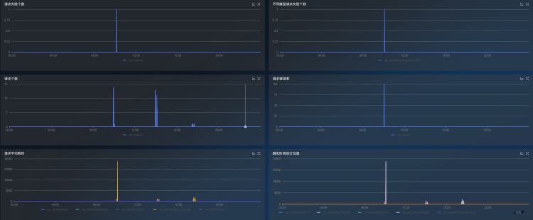

# LangChainMonitor 插件
在您服务的环境中配置环境变量
```
export DD_SERVICE="your_app_name"
```
在调用langchain代码中引入 [**ddtrace**](https://github.com/DataDog/dd-trace-py) 包
```
pip install ddtrace>=1.17
```
下面是代码示例，你可以直接运行来测试
```
import os
from langchain import OpenAI
from langchain.chat_models import ChatOpenAI
from flask import Flask
from ddtrace import tracer, patch

app = Flask(__name__)
tag = {
    'env': 'test',
    'tenant': 'default', # 配置租户信息
    'version': 'v0.1'
}
# 配置Collector_DataDog地址及端口
tracer.configure(
    hostname="localhost",
    port="5001"
)
tracer.set_tags(tag)
patch(langchain=True)

os.environ["OPENAI_API_KEY"] = "sk-***********" # 填写openai的api_key
os.environ["OPENAI_PROXY"] = "******"           # 按需配置代理地址

@app.route('/test/langchain')
def hello_world():
    return ChatFuc('gpt-3.5-turbo')

def OpenAIFuc(model):
    random_string = 'Hello World!'
    chat = OpenAI(temperature=0, model_name=model, max_tokens=50)
    return chat.predict(random_string)

def ChatFuc(model):
    random_string = 'Hello World!'
    chat = ChatOpenAI(temperature=0, model_name=model)
    return chat.predict(random_string)


if __name__ == '__main__':
    app.run(port=5003)
```
调用接口
```
curl --location --request GET 'localhost:5003/test/langchain'
```
打开页面 http://localhost:8080/integration/agentComp?tenant=default.

在集成组件页面安装LangChainMonitor插件

点击预览


可以自动生成LangChain监控仪表盘，监控token使用情况及接口请求情况




