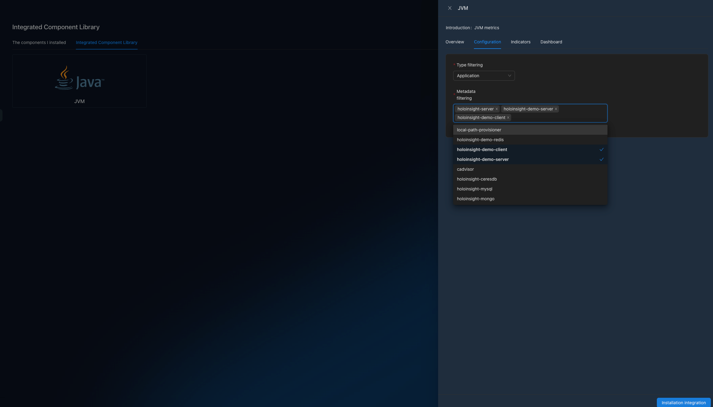

# JVM 性能监控
打开页面 http://localhost:8080/integration/agentComp?tenant=default.

安装 `JVM` 集成组件，在本例子里配置应用名单为 `[holoinsight-server, holoinsight-demo-server, holoinsight-demo-client]`.

等待几分钟.

打开页面 http://localhost:8080/app/dashboard/jvm?app=holoinsight-server&id=6&tenant=default

