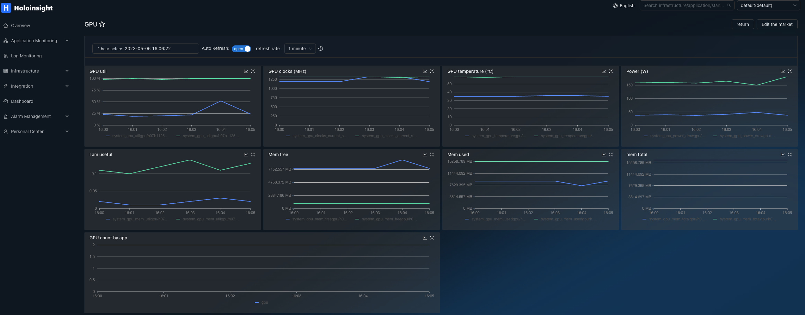
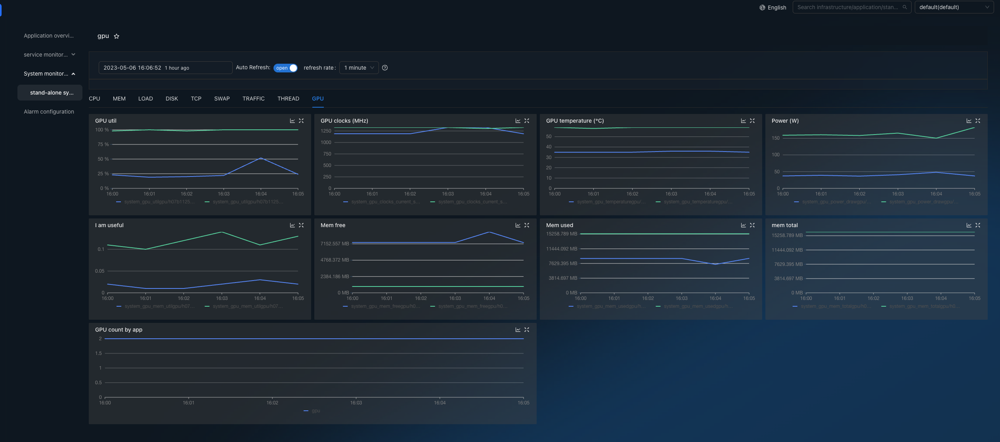

# GPU
HoloInsight-Agent uses a query on the [nvidia-smi](https://developer.nvidia.com/nvidia-system-management-interface) binary to pull GPU stats including memory and GPU usage, temp and other.

This GPU plugin is automatically activated if `nvidia-smi` is present.

This plugin does not require any configuration.




# nvidia-smi commands

List all GPUs
```bash
nvidia-smi -L
```

Query GPU,memory utilization
```bash
nvidia-smi --query-gpu=index,utilization.gpu,utilization.memory --format=csv
```

> nvidia-smi --help-query-gpu

Query memory usage
```bash
nvidia-smi --query-gpu=index,memory.used,memory.free,memory.total --format=csv
```

Query version and driver
```bash
nvidia-smi --query-gpu=index,name,vbios_version,driver_version --format=csv
```

Query temperature,power,clocks
```bash
nvidia-smi --query-gpu=index,power.draw,temperature.gpu,clocks.current.sm,clocks.current.memory,fan.speed --format=csv
```

Query GPU used memory of pids
```bash
nvidia-smi --query-compute-apps=gpu_uuid,pid,used_memory --format=csv
```
