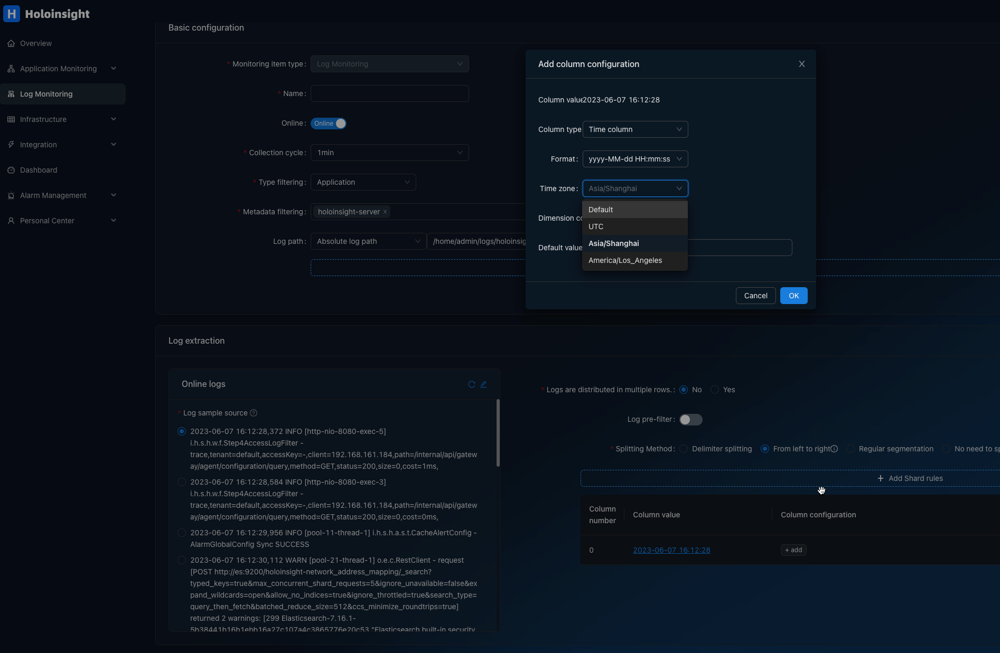

# Log timeparse
When using log monitoring, if no time column is explicitly configured, HoloInsight-Agent will try to automatically parse the time from the log.
But it can only support a few common formats.

The following formats are supported:
- "2006-01-02 15:04:05",
- "2006/01/02 15:04:05",
- "2006-01-02T15:04:05",
- "2006 Jan/02 15:04:05",
- "02/Jan/2006 15:04:05",
- "Jan 02 2006 15:04:05",
- "01/02/2006 15:04:05",

Each format allows a prefix of 4 characters or fewer.
So '[2006-01-02 15:04:05] INFO [main] xxx biz log' can also be parsed normally.

In addition, second-level timestamps and millisecond-level timestamps are also supported, but this requires the timestamp to appear at the beginning of the line, and the length is 10 (second-level timestamp) or 13 (millisecond-level timestamp), and there is no prefix.
For example:
- '1668517987  INFO [main] xxx biz log' can also be parsed normally'
- '1668517987000  INFO [main] xxx biz log' can also be parsed normally'

If your timestamps can't be parsed automatically, then maybe:
1. Timestamp format is not common
2. The position of the timestamp is not at the beginning of the line

At this point, you need to explicitly configure the timestamp parsing method on the page:

# Log timezone
When parse str to time, the `timezone` is required.
HoloInsight-Agent use the `/etc/localtime` of main container of target pod as the timezone to parse time in logs.
> In most cases, a pod contains a business container and sandbox container. The business container is the main container of the pod.
> When a pod contains more than 2 containers (including sandbox container), non-sandbox containers will be divided into biz and sidecar containers.
> At this time, it is required that there is only one biz, otherwise the acquisition target is not unique.
> The judgment method of sidecar container can refer to the code of HoloInsight-Agent: DefaultSidecarCheckHookInstance.

For details, refer to this article https://man7.org/linux/man-pages/man5/localtime.5.html.
If fail to parse `/etc/localtime` the default timezone is UTC.

This is currently the only authoritative source for the log time zone. Other methods such as the TZ environment variable, or various programming language control time zone methods cannot be supported by HoloInsight-Agent.
