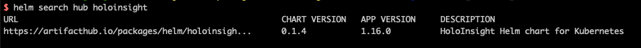

# Helm charts management
Following the instructions in [this document](https://helm.sh/docs/howto/chart_releaser_action/), we created a repository [holoinsight-helm-charts](https://github.com/traas-stack/holoinsight-helm-charts) and configured Github actions.

Whenever code is pushed to the main branch, the build and release of the helm chart will be triggered.

There are several rules:
1. The Github repository can contain multiple Charts, all placed in the /charts directory
2. The release will be triggered whenever the version of Chart.yaml is updated
3. The corresponding tag and release will be created when publishing, unless there is an error, otherwise it will not be deleted (if you delete it, you need to cascade and change a lot of things)
4. After publishing, the Github action will update the index.yaml under the gh-pages branch, which is the index file required by Helm

Then we create a repository in [artifacthub.io](https://artifacthub.io), linking it with our Github repository.  
Now HoloInsight Helm Chart can be found in [artifacthub.io](https://artifacthub.io/packages/helm/holoinsight/holoinsight) or Helm Cli.
```bash
helm search hub holoinsight
```


> It takes 30 min ~ 1 hour for artifacthub.io to sync metadata from Github after our push.

# Update Chart Guide
1. Update Chart content
2. Update version/appVersion in Chart.yaml according to https://helm.sh/docs/topics/charts/ and https://semver.org/
3. Write changelogs in README.md of the Chart
4. Create a PR to main branch of [holoinsight-helm-charts](https://github.com/traas-stack/holoinsight-helm-charts) 

# References
- https://helm.sh/docs/howto/chart_releaser_action/
- https://github.com/helm/chart-releaser-action
