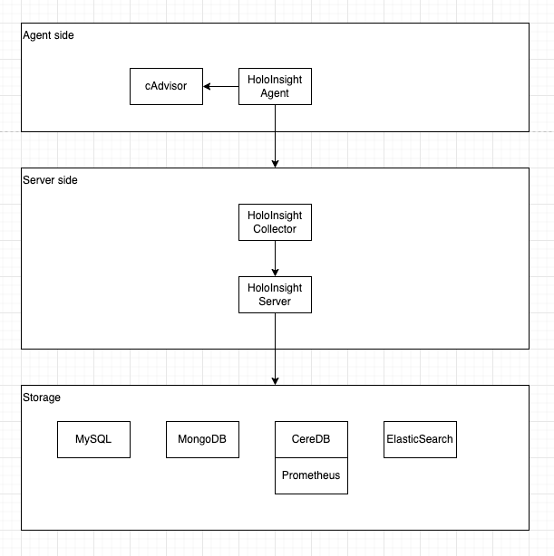

# Deployment

This article introduces the deployment of HoloInsight and HoloInsight Agent based on Helm.



What you need:

- Basic knowledge of [K8s](https://kubernetes.io/)
- Basic knowledge of [Helm v3](https://helm.sh/)
- A K8s cluster (specification > 4G8G), it is recommended to use [K3s](https://docs.k3s.io/) for practice
- A development environment for Linux or Mac
- Git

# Deploy HoloInsight

Note that in this example, the database part will also be deployed together with the Helm Chart, but they are unreliable and do not use any high-availability solutions and persistent storage, which means that once you redeploy, you will lose all data.
In production-level practice, you need to prepare these four databases (manually deploy or purchase services provided by cloud vendors), and make them highly available at the production level.

**Upgrade or install (update)** the latest version of HoloInsight in the `holoinsight-server` namespace:

```bash
# Add holoinsight repository
helm repo add holoinsight https://holoinsight.github.io/holoinsight-helm-charts/

kubectl create namespace holoinsight-server
helm -n holoinsight-server upgrade --install holoinsight holoinsight/holoinsight
```

If you want to install a specific version:
```bash
helm -n holoinsight-server upgrade --install --version 1.0.0 holoinsight holoinsight/holoinsight
```

Wait for all Pods to be in **Ready** state. You can visually observe the progress using the following command:

```bash
kubectl -n holoinsight-server get pods -w
```

Example output:
```text
$ kubectl -n holoinsight-server get pods -w
NAME                                      READY   STATUS    RESTARTS   AGE
holoinsight-mongo-0                       1/1     Running   0          100s
holoinsight-mysql-0                       1/1     Running   0          100s
holoinsight-collector-5c5946df87-s24qm    1/1     Running   0          100s
holoinsight-collector-5c5946df87-wtw4g    1/1     Running   0          100s
holoinsight-prometheus-69795584d6-8fljk   1/1     Running   0          100s
holoinsight-es-0                          1/1     Running   0          100s
holoinsight-ceresdb-0                     1/1     Running   0          100s
holoinsight-server-0                      1/1     Running   0          100s
```

## Initialize HoloInsight
**When deploying for the first time**, HoloInsight needs to do some initialization. This step can be skipped for non-first-time deployments.
The current product layer lacks an initialization guide page, so it needs to be initialized through a script. It does the following:

1. Add a tenant named "default" and configure its storage to use CeresDB
2. Add an apikey "default"
3. Import the JVM plugin
4. Add the application monitoring left menu configuration

```bash
git clone https://github.com/traas-stack/holoinsight-helm-charts

# The behavior of some scripts depends on a specific version. If the HoloInsight you just installed is not the latest version,
# It is recommended that you use git checkout holoinsight-1.0.0 to switch to the corresponding version.
./scripts/holoinsight/init.sh
```

Example output:
```text
[database] wait for [holoinsight-mysql] to be ready
partitioned roll out complete: 1 new pods have been updated...

[database] wait for [holoinsight-server] to be ready
partitioned roll out complete: 1 new pods have been updated...

[database] populate init data
mysql: [Warning] Using a password on the command line interface can be insecure.
done
```

## Visit the product page
In production-level practice, you need to manually create [Ingress](https://kubernetes.io/zh-cn/docs/concepts/services-networking/ingress/) and expose it as a domain name.
> Usually the configuration of Ingress depends on the specific deployment environment, so it is not provided in this Helm Chart.

The page access method provided here can only be used in the testing phase.

Map HoloInsight port 80 to local port 8080:
```bash
./scripts/server-port-forward.sh
```

Example output:
```text
Visit HoloInsight at http://localhost:8080
Forwarding from 127.0.0.1:8080 -> 80
Forwarding from [::1]:8080 -> 80
Handling connection for 8080
```

Just visit http://localhost:8080.

## Customize HoloInsight
For example, modify the image version and increase the container size. For details about which customizations are supported, please refer to the Chart content.
Create a new file values.yaml
```yaml
server:
  image: holoinsight/server:ANOTHER_TAG
  resources:
    requests:
      cpu: "4"
      memory: "8Gi"
    limits:
      cpu: "4"
      memory: "8Gi"
# applicationYaml: override application.yaml of Spring Boot
```

For more configuration, see [server-bootstrap-configuration](../../../dev-guide/run/server-bootstrap-configuration.html).

Execute the following command to install or upgrade (update):
```yaml
helm -n holoinsight-server upgrade --install holoinsight -f values.yaml
```

## View the deployment
```bash
helm -n holoinsight-server list
```

## Uninstall HoloInsight
```bash
helm -n holoinsight-server uninstall holoinsight
```

# Deploy HoloInsight Agent

Edit values.yaml

```yaml
apikey: "default"
common_version: '1'
workspace: "default"
cluster: "default"

server:
  registry:
    addr: registry.holoinsight-server:7202
  gateway:
    addr: gateway.holoinsight-server:19610
  secure: false


# If you are using containerd or containerd based k3s, you should mount containerd run directory into cadvisor.
# The following is the config for k3s+containerd.
#cadvisor:
#  volumes:
#  - name: containerd
#    hostPath:
#      path: /run/k3s/containerd
#  volumeMounts:
#  - name: containerd
#    mountPath: /run/containerd
#    readOnly: true

```
For more configuration, see [agent-bootstrap-configuration](../../../dev-guide/run/agent-bootstrap-configuration.html).

To install or upgrade (update) HoloInsight-Agent in the `holoinsight-agent` namespace:
```bash
kubectl create namespace holoinsight-agent
helm -n holoinsight-agent upgrade --install holoinsight-agent holoinsight/holoinsight-agent -f values.yaml 
```

## Uninstall HoloInsight-Agent
```bash
```bash
helm -n holoinsight-agent uninstall holoinsight-agent
```

# Install the sample application
Before exploring HoloInsight, it is recommended to install 2 instances and apply them to the K8s cluster. Let them generate some call traffic to improve the display on HoloInsight.

```bash
kubectl apply -f https://github.com/traas-stack/holoinsight-helm-charts/blob/main/scripts/holoinsight/demo.yaml
```

# Exploring HoloInsight for the first time
TODO
