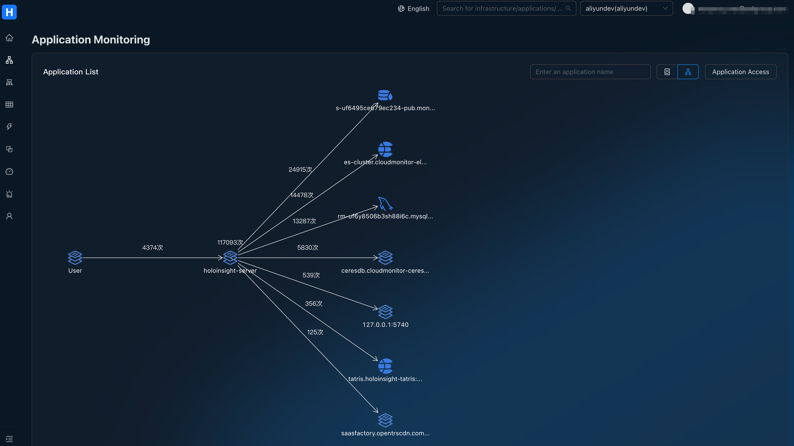
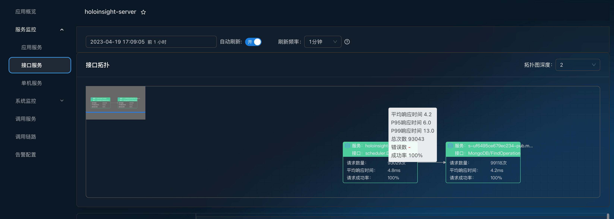

# Service Topology
HoloInsight Service Topology builds service topology from multiple perspectives such as tenants, applications, interfaces, instances, and components, helping you quickly inspect your global architecture and traffic distribution.

A service topology consists of `nodes` and `edges`. A node represents the service overview provided by the resources it describes, and an edge represents the calling relationship between two specific nodes.

You can inspect the topology of all applications from the perspective of tenants.

And you can also focus on a certain application, interface or instance, and inspect their upstream and downstream based on the view depth you choose.

