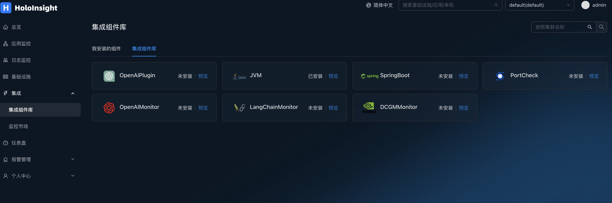
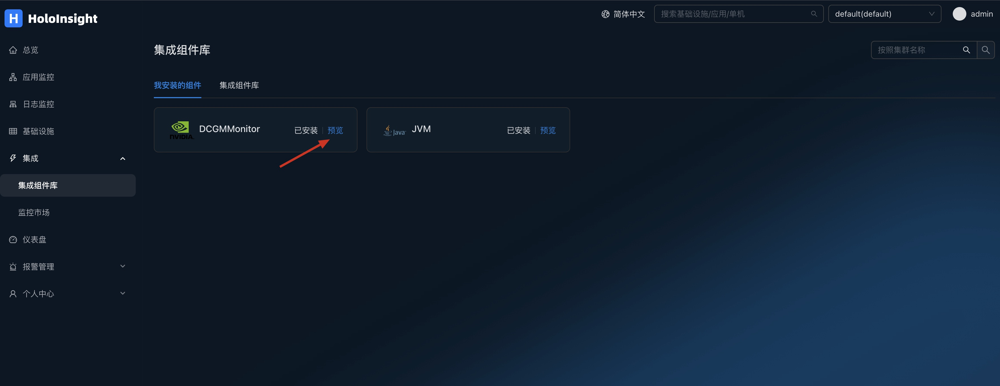
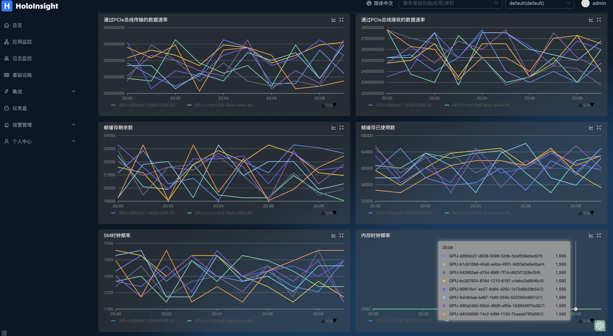
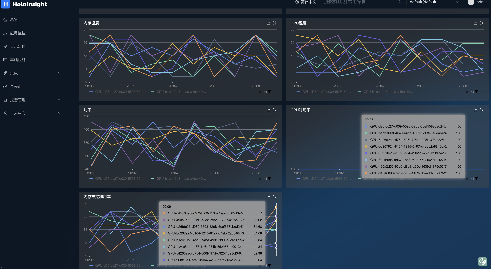

# dcgmMonitor 插件
Deploy the k8s environment on your GPU machine, and install dcgm-exporter and Holoinsigh-Agent, as described in the documentation

[**dcgm-exporter**](https://github.com/NVIDIA/dcgm-exporter#quickstart-on-kubernetes)

[**holoinsight-agent**](https://traas-stack.github.io/holoinsight-docs/en/operations/deployment/k8s.html#deploy-holoinsight-agent)

By default, GPU data is collected after installation

Open page http://localhost:8080/integration/agentComp?tenant=default.

Install the DCGMMonitor plug-in on the Integration Components page

Click to preview

DCGMMonitor dashboards can be automatically generated to monitor GPU information

