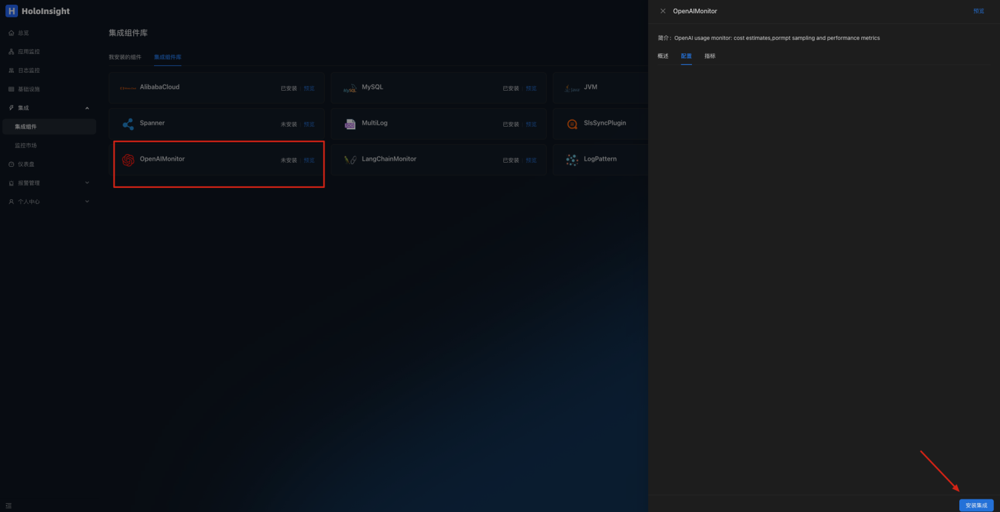
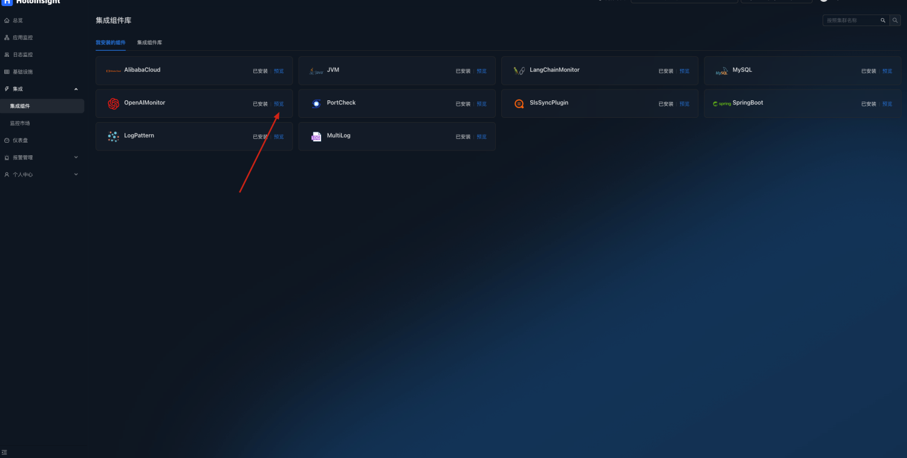
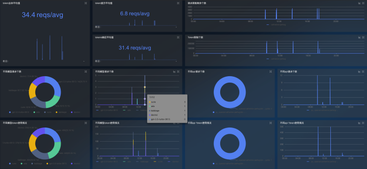
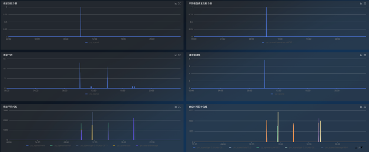

# OpenAIMonitor plugin
Configure environment variables in the environment of your service
```
export DD_SERVICE="your_app_name"
```
Import [**ddtrace**](https://github.com/DataDog/dd-trace-py) package in the OpenAI code
```
pip install ddtrace>=1.13
```
Below is a code sample that you can run directly to test
```
import openai
from flask import Flask
from ddtrace import tracer, patch

app = Flask(__name__)
tag = {
    'env': 'test',
    'tenant': 'default', # Configuring tenant information
    'version': 'v0.1'
}
# Set the Collector_DataDog address and port
tracer.configure(
    hostname='localhost',
    port='5001'
)
tracer.set_tags(tag)
patch(openai=True)

@app.route('/test/openai')
def hello_world():
    openai.api_key = 'sk-***********' # Enter the openai api_key
    openai.proxy = '*******'          # Configure proxy addresses as required
    return ChatCompletion('gpt-3.5-turbo')


def ChatCompletion(model):
    content = 'Hello World!'
    messages = [{'role': 'user', 'content': content}]
    result = openai.ChatCompletion.create(api_key=openai.api_key, model=model, messages=messages)
    print('prompt_tokens: {}, completion_tokens: {}'.format(result['usage']['prompt_tokens'],
                                                         result['usage']['completion_tokens']))
    return result

def Completion(engine):
    content = 'Hello World!'
    result = openai.Completion.create(engine=engine, prompt=content, max_tokens=50)
    print('prompt_tokens: {}, completion_tokens: {}'.format(result['usage']['prompt_tokens'],
                                                            result['usage']['completion_tokens']))
    return result


if __name__ == '__main__':
    app.run(port=5002)
```
Calling interface
```
curl --location --request GET 'localhost:5002/test/openai'
```
Open page http://localhost:8080/integration/agentComp?tenant=default.

Install the OpenAIMonitor plug-in on the Integration Components page

Click to preview


OpenAI monitoring dashboards can be automatically generated to monitor token usage and interface requests




