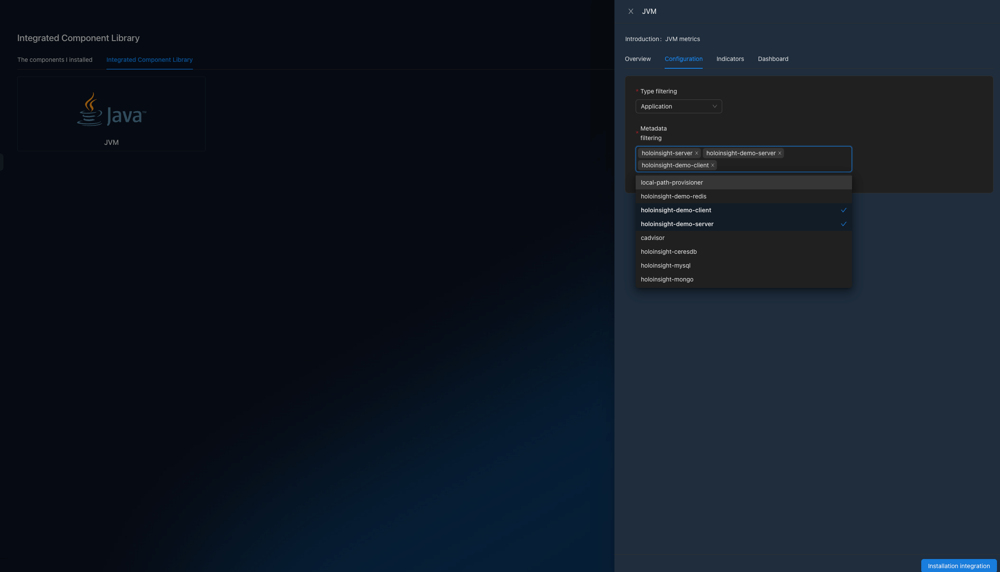

# JVM performance monitor
Go to http://localhost:8080/integration/agentComp?tenant=default.

Install the `JVM` integration component with application in `[holoinsight-server, holoinsight-demo-server, holoinsight-demo-client]` (for example).

Wait a few minutes.

Visit http://localhost:8080/app/dashboard/jvm?app=holoinsight-server&id=6&tenant=default

