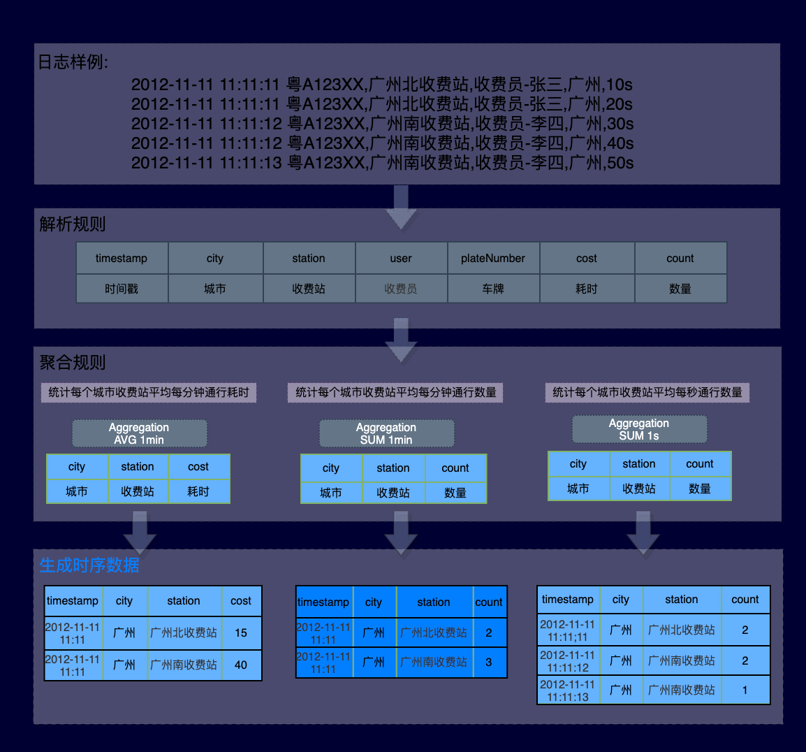

# HoloInsight Log Monitoring
Log data naturally has good characteristics. 
* First of all, logs are very structured data that grows over time and is persistent on disk, which has very good fault tolerance for users. 
* Secondly, the log is very good to shield the difference of the system itself, whether it is a system developed in Java or a system written in Python or C++, after the log disk is homogeneous data, there is no need to adapt the observation system. 
* Third, log-based observation is non-intrusive, there is no need to connect the third-party SDK to the business process, and effectively prevent various performance, stability, security and other concerns brought about by external code intrusion.

HoloInsight allows you to monitor logs, freely count the required indicators, combine and calculate them, and generate the necessary data and reports.  This tutorial explains how to use log monitoring.
[Create log monitoring](create-log-monitor.md)

The specific flow diagram can be seen in the following figure

There are also some higher-order features:
1. [Key word count](key-word-collect.md)
2. [Log folder](log-folder.md).
3. [Dim translate](dim-translate.md).
3. [Post filtering](log-after-filter.md).
4. [Log pattern](log-pattern.md).
5. [Log sample](log-sample.md).

