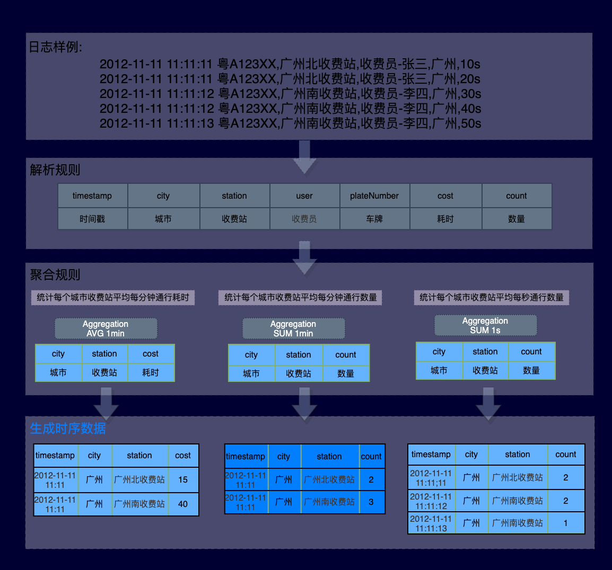

Log monitoring is a general term for various customized and personalized data access methods. 
You can use custom monitoring to access various types of log data sources, collect required indicators, 
combine and calculate them, and generate required data and reports. You can also configure alarms for monitoring items 
to learn about data anomalies in time and handle them accordingly. 

This section describes how to create a log monitoring.

### Schematic Diagram

### Step 1: Create log monitoring
1. Log on to the **HoloInsight Monitoring Console** and click **Log monitoring** in the left navigation bar.
2.  Add monitoring
    There are two methods for adding a monitor. You can select one based on your requirements.
    - Method 1: Click **Add** in the upper right corner to add a monitor.
    - Method 2:  Tap **Create folder**, to add a monitor in the folder.

### Step 2: Configure log monitoring
Configuring log monitoring includes **Basic configuration**, **Log extraction**, and **Metric definition**.
#### Basic configuration

- **Name**: The name of log monitor.
- **Online status**: The status of the acquisition configuration, online status is valid.
- **Acquisition period**: The default is 1min, and users can adjust it as needed.
- **Type filtering**: Filter the range of acquisition.
- **Log path**:

  - Support absolute path.
  - Support regex to match log path.
  - Support matching log paths that contain variables. Currently only date variables are supported.
#### Extract logs

1. Extract online logs
- Pull online log: Tap the **Refresh** icon to pull online logs again. 

- Edit online log source: Click the** Edit **icon to select the log sample source, either **Online logs** or **Manual input**.

    i. Select **Online log**, follow the steps below to configure it.
    - In the **Specify server** **IP** text box field, enter the IP address.
    - Fill in the corresponding description content in the **Log** **sample**.
    - Click **OK**, so the online log is pulled successfully.  
    
    ii：Select **Manual input**, Perform the following steps to configure:

- Fill in the description content in the **Log input**.
- Tap **OK**. The online log is pulled successfully.

2. Configure the log distribution

   **Logs distributed in multiple lines**: Choose yes or no. 
   - Select **No**: no configuration is required. 
   - Select **Yes**: follow the steps below to configure it. 
   - Select **Specify location** text box head line or end of line to of the log. 
   - Enter a regexp in the **Regular expression** text box to describe header or footer of the log, easier for the Agent to cut the log.
   

3. Configure log prefilter

**Log pre-filtering**: Select whether to enable the log pre-filtering function.

1. Disable the **log prefilter** function. No configuration is required.
2. Enable the **log prefilter** function. Follow the steps below to configure it:
    1. In the **Preceding rules**, click **Add filter rule**.  **Add column definition** panel pops up.

   2. In the **Add column definition** panel, select **Filter rules**, you can match keywords or filter from left to right.
      - Match Keywords
      - From left to right
4. Segmentation rules

There are four types of segment rules. You can choose the one right for your needs.

- From left to right

  - In the **Segmentation method** selection bar, click **From left to right**.
  - Click **Add segmentation rule** to jump to the **Add column definition** panel.
 

  - Complete information under the **Add column definition** panel and click **Confirm.**

  - Click **Add** in the **Column configuration** field to enter the **Edit column configuration** panel and edit the column configuration.

  - After editing the **Edit Column Configuration** panel, click **OK**. The configuration of segmentation rule of from left to right is complete.

- By separator

  i. In the segmentation method selectionbar, click **By separator**, and separator text box pops up.
  ⅱ. Enter the separator in the separator text box and click **Confirm Segmentation**.
  ⅲ. Click **Add** in the** Column Configuration** column to define the column value for the field after segmentation.
  

- By regex

  i. Under segment mode selectionbar, click **By regex**, and regular expression text box pops up.
  ⅱ. In the **Regular expreession** text box, enter the regexp and Click **Segment**.
  d. Skip segmentation
  In the column for selecting a **segment mode**, click** Skip**.
#### Definition of metrics

1. Click **Add Monitoring metrics** to slide out the** Add monitoring metric **panel on the right.

2. On the **Add monitoring metrics** page, fill in configuration info.
    1. **Name**: Enter the name of the new monitoring metric.
    2. **Metric definition**: Select the desired metric definition.
       ▪ **Log traffic**: Monitor by log traffic. 
       ▪ **Keyword count**: Monitor the metric by entering keywords and performing counting. 
       ▪ **Numerical Extraction**: Monitor numerical metrics by entering the corresponding numerical values.
    

3. After filling it, click **Save.**
### Step 3: View data

1. On the left navigation bar, select **Log monitoring** and click **Monitoring configuration**. The** Data preview** page is displayed.

2. On the** Data preview** page, you can view data.