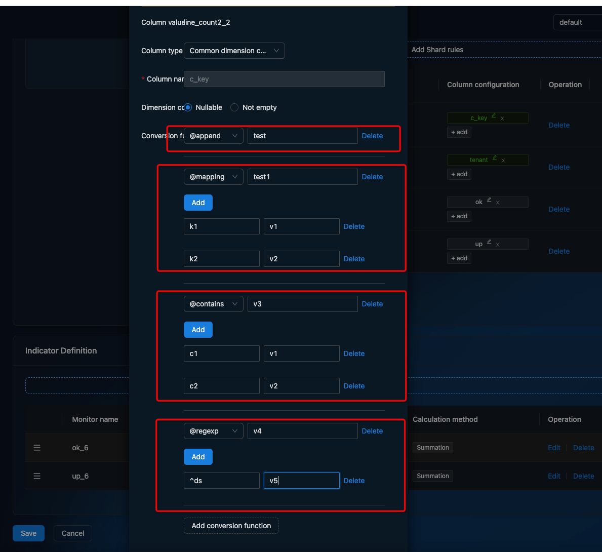

# Dim Translate
Fields that are shred for log monitoring can be converted to easy-to-understand strings using conversion functions

The conversion function can do **_elect_** (shred) out of the field to continue to do the conversion, the process is similar to the unix pipeline.

````
pipeline = echo x | filter1 arg0 | filter2 arg1 arg2 | filter3 arg3
````

Here we support 5 conversion functions
1. @append
   - doc: Append content to the string
   - params:
     - value: content string
2. @mapping
   - doc: Replace the sliced string with a new string
   - params:
      - value: Map string
3. @regexp
   - doc: Replace the sliced string that satisfies the regular expression with a new string
   - params:
      - value: Map string
4. @contains
- doc: Replace the sliced string containing the keyword with a new string
   - params:
    - value: Map string
5. @const
   - doc: Replace the sliced string containing the keyword with a constant string
   - params:
      - value: const string
   



### Use Case
#### Case1 : Column Value Translation
````
filters:
- switchCaseV1:
  	cases: 
    - caseWhere: 
        regexp: 
          pattern: "^hello (.*)$"
          catchGroups: true
      action:
      	regexpReplace1: "your name is $1"
    - caseWhere: 
        regexp: 
          pattern: "^login (.*)$"
          catchGroups: true
      action:
      	const:
      		value: "user login"
   defaultAction:
     const: "unknown"
````

#### Case2 : Mapping
````
filters:
- switchCaseV1:
  	cases: 
    - caseWhere: 
        eq: 
          value: "a"
      action:
      	const: "1"
    - caseWhere:
       eq:
         value: "b"
      action:
      	const: "2"
     - caseWhere: 
       eq:
         value: "c"
      action:
      	const: "3"
   defaultAction:
     const: "unknown"
````

The meaning of this configuration is
````
var map = {"a":"1","b":"2","c":"3"}
var v, exist = map[x]
if !exist {
  v = "unknown"
}
````