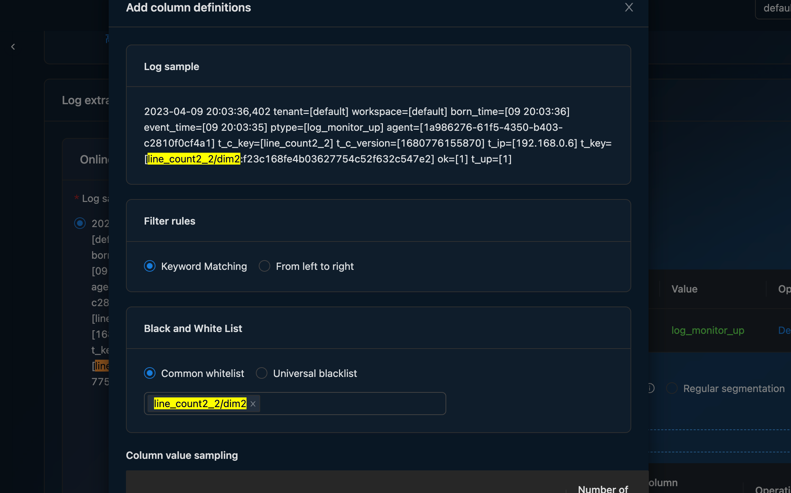
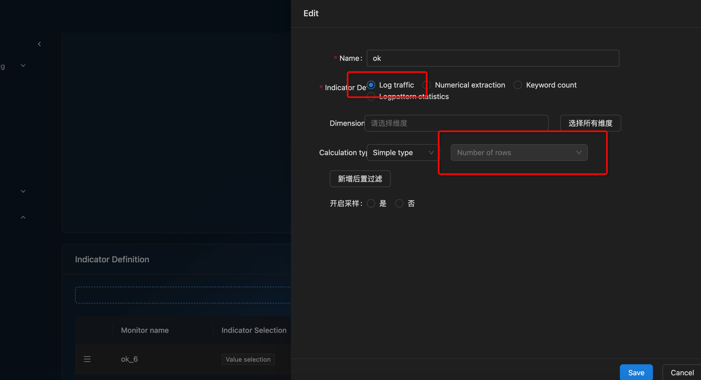
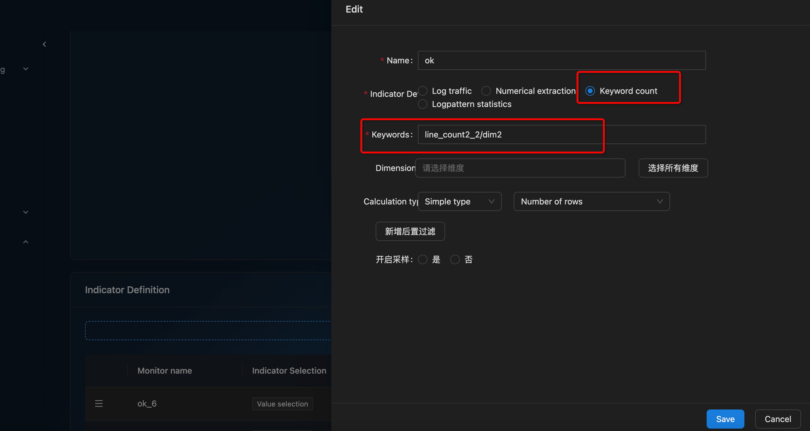

# Key Word Count

There are two ways to monitor keyword matches

### Method 1
- Matching is performed by pre-filtering

- Then find the number of rows in the indicator configuration

### Method 2
You can configure the keyword line count during counter configuration

