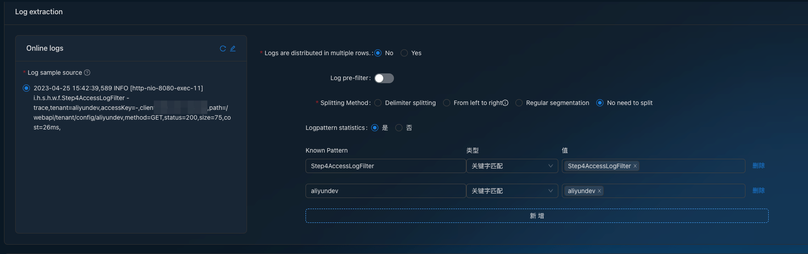
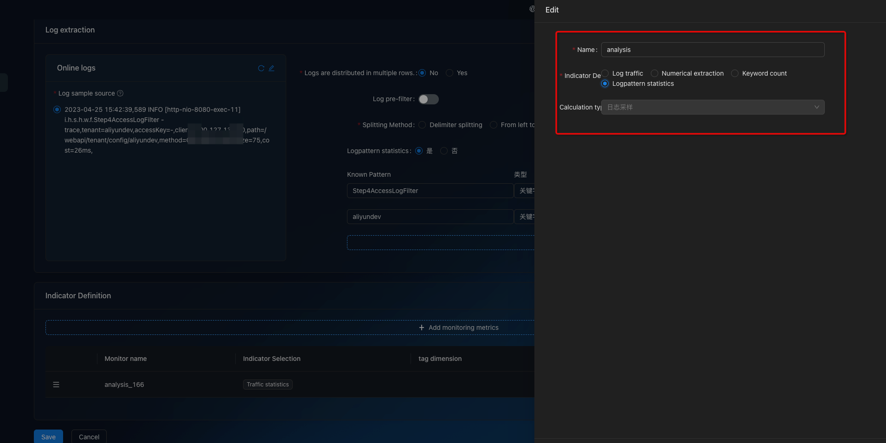
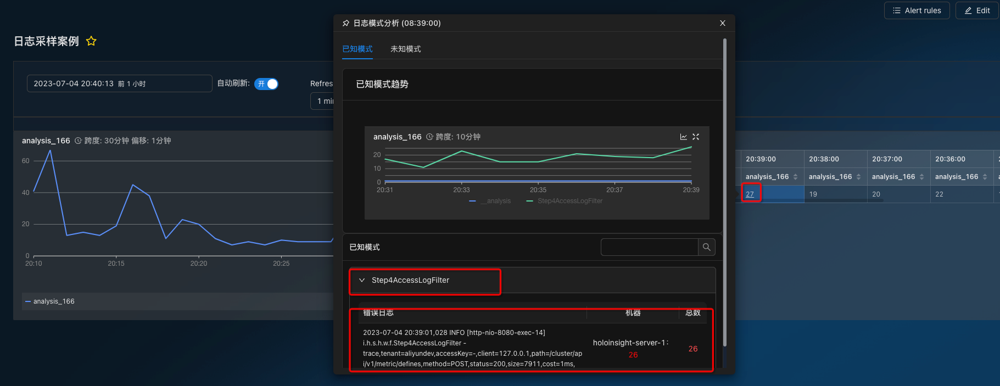

# Log pattern
Pattern matching is a user-defined monitoring plugin. It monitors and collects statistics on keywords that are not in fixed positions in logs. For example, it collects statistics on certain errors in Error logs. Pattern matching is mostly used for logs with irregular formats, such as logs without dates.

### Use Case
- Collect the number of logs that match a Pattern
- Intelligent clustering is performed according to log similarity, and the number of keyword occurrences in intelligent clustering is counted
- Storage keeps some log samples


### Step1
- select *Logpattern statistics* 
- Two methods are supported: 
  - One is to generate event codes based on keywords matching log content. 
  - The other supports log generated event codes that satisfy regular expressions.



### Step2

When configuring indicators, you need to select a mode matching mode



### Step3
Placing the mouse over the number brings up the sampling event.



### Config Meta
````
{
  "select": {
    "values": [
      {
        "as": "value",
        "_doc": "对于 loganalysis 必须这么写",
        "agg": "loganalysis"
      }
    ]
  },
  "from": {
    "type": "log",
    "log": {
      "path": [
        {
          "type": "path",
          "pattern": "/home/admin/logs/gateway/common-default.log"
        }
      ],
      "charset": "utf-8"
    }
  },
  # where 依旧可以用来过滤日志
  "where": {
    "in": {
      "elect": {
        "type": "refIndex",
        "refIndex": {
          "index": 2
        }
      },
      "values": [
        "INFO"
      ]
    }
  },
  "groupBy": {
    "loganlysis": {
    	# 此处对应上面的 Conf
      "patterns": [{
        "name": "io exception",
        "where": {
          "contains": {
            "elect": {
				"type" : "line",
            },
            "value": "IOException"
          }
        },
        "maxSnapshots": 3
      }, {
        "name": "runtime exception",
        "where": {
          "contains": {
            "elect": {
				"type" : "line",
            },
            "value": "RuntimeException"
          }
        },
        "maxSnapshots": 3
      }],
      "maxSnapshots"`: 3,
      "maxUnknownPatterns": 10,
      "maxKeywords": 50
  	},
    
  },
  "window": {
    "interval": "1m"
  },
  "executeRule": {
  },
  "output": {
    "type": "cmgateway",
    "cmgateway": {
      "metricName": "metric_table"
    }
  }
}
````

### Query Data

Logs are stored in: **${metricName}__analysis_**, Its value is a json string with the following format.
````
{
  "samples": ["line1", "line2", "line3"],
  "maxCount": 10
}
````
### Case1: UnKnow Pattern

````
# REQUEST
curl -l -H "Content-type: application/json" -H "accessKey: test"  -X POST http://127.0.0.1:8080/webapi/v1/query -d'
{
  "datasources": [
    {
      "metric": "loganalysis_analysis",
      "start": 1670505300000,
      "end": 1670505360000,
      "filters": [
        {
          "type": "literal",
          "name": "eventName",
          "value": "__analysis"
        }
      ],
      "aggregator": "unknown-analysis",
      "groupBy": [
        "app",
        "eventName"
      ]
    }
  ]
}

#  RESPONSE
{
  "success": true,
  "message": null,
  "resultCode": null,
  "data": {
    "results": [
      {
        "metric": "loganalysis_analysis",
        "tags": {
          "app": "holoinsight-server"
        },
        "values": [
          [
            1670505350000,
            "{\"mergeData\":{\"analyzedLogs\":[{\"parts\":[{\"content\":\"INFO\",\"source\":false,\"important\":false,\"count\":1},{\"content\":\"scheduling-1\",\"source\":false,\"important\":false,\"count\":1},{\"content\":\"i.h.s.g.c.a.TenantService\",\"source\":false,\"important\":false,\"count\":1},{\"content\":\"tenant\",\"source\":false,\"important\":false,\"count\":1},{\"content\":\"size\",\"source\":false,\"important\":false,\"count\":1},{\"content\":\"52\",\"source\":false,\"important\":false,\"count\":1},{\"content\":\"cost\",\"source\":false,\"important\":false,\"count\":1},{\"content\":\"1\",\"source\":false,\"important\":false,\"count\":1}],\"sample\":\"2022-12-08 21:15:52,000 INFO  [scheduling-1] i.h.s.g.c.a.TenantService - [tenant] size=[52] cost=[1]\",\"ipCountMap\":{\"holoinsight-server-1\":1},\"count\":1},{\"parts\":[{\"content\":\"INFO\",\"source\":false,\"important\":false,\"count\":1},{\"content\":\"scheduling-1\",\"source\":false,\"important\":false,\"count\":1},{\"content\":\"i.h.s.c.a.ApikeyService\",\"source\":false,\"important\":false,\"count\":1},{\"content\":\"apikey\",\"source\":false,\"important\":false,\"count\":1},{\"content\":\"size\",\"source\":false,\"important\":false,\"count\":1},{\"content\":\"56\",\"source\":false,\"important\":false,\"count\":1},{\"content\":\"cost\",\"source\":false,\"important\":false,\"count\":1},{\"content\":\"2\",\"source\":false,\"important\":false,\"count\":1}],\"sample\":\"2022-12-08 21:15:52,017 INFO  [scheduling-1] i.h.s.c.a.ApikeyService - [apikey] size=[56] cost=[2]\",\"ipCountMap\":{\"holoinsight-server-1\":1},\"count\":1}]},\"ipCountMap\":{\"holoinsight-server-1\":2}}"
          ]
        ]
      },
      {
        "metric": "loganalysis_analysis",
        "tags": {
          "app": "holoinsight-server"
        },
        "values": [
          [
            1670505315000,
            "{\"mergeData\":{\"analyzedLogs\":[{\"parts\":[{\"content\":\"INFO\",\"source\":false,\"important\":false,\"count\":1},{\"content\":\"grpc-for-agent-2\",\"source\":false,\"important\":false,\"count\":1},{\"content\":\"i.h.s.r.c.m.MetaSyncService\",\"source\":false,\"important\":false,\"count\":1},{\"content\":\"curd detail\",\"source\":false,\"important\":true,\"count\":1},{\"content\":\"need compare\",\"source\":false,\"important\":true,\"count\":1},{\"content\":\"14\",\"source\":false,\"important\":false,\"count\":1}],\"sample\":\"2022-12-08 21:15:17,343 INFO  [grpc-for-agent-2] i.h.s.r.c.m.MetaSyncService - curd detail, need compare: 14\",\"ipCountMap\":{\"holoinsight-server-1\":3},\"count\":3}]},\"ipCountMap\":{\"holoinsight-server-1\":3}}"
          ]
        ]
      },
      {
        "metric": "loganalysis_analysis",
        "tags": {
          "app": "holoinsight-server"
        },
        "values": [
          [
            1670505345000,
            "{\"mergeData\":{\"analyzedLogs\":[{\"parts\":[{\"content\":\"INFO\",\"source\":false,\"important\":false,\"count\":1},{\"content\":\"scheduling-1\",\"source\":false,\"important\":false,\"count\":1},{\"content\":\"i.h.s.g.c.a.TenantService\",\"source\":false,\"important\":false,\"count\":1},{\"content\":\"tenant\",\"source\":false,\"important\":false,\"count\":1},{\"content\":\"size\",\"source\":false,\"important\":false,\"count\":1},{\"content\":\"52\",\"source\":false,\"important\":false,\"count\":1},{\"content\":\"cost\",\"source\":false,\"important\":false,\"count\":1},{\"content\":\"1\",\"source\":false,\"important\":false,\"count\":1}],\"sample\":\"2022-12-08 21:15:46,419 INFO  [scheduling-1] i.h.s.g.c.a.TenantService - [tenant] size=[52] cost=[1]\",\"ipCountMap\":{\"holoinsight-server-0\":1},\"count\":1},{\"parts\":[{\"content\":\"INFO\",\"source\":false,\"important\":false,\"count\":1},{\"content\":\"scheduling-1\",\"source\":false,\"important\":false,\"count\":1},{\"content\":\"i.h.s.c.a.ApikeyService\",\"source\":false,\"important\":false,\"count\":1},{\"content\":\"apikey\",\"source\":false,\"important\":false,\"count\":1},{\"content\":\"size\",\"source\":false,\"important\":false,\"count\":1},{\"content\":\"56\",\"source\":false,\"important\":false,\"count\":1},{\"content\":\"cost\",\"source\":false,\"important\":false,\"count\":1},{\"content\":\"2\",\"source\":false,\"important\":false,\"count\":1}],\"sample\":\"2022-12-08 21:15:46,437 INFO  [scheduling-1] i.h.s.c.a.ApikeyService - [apikey] size=[56] cost=[2]\",\"ipCountMap\":{\"holoinsight-server-0\":1},\"count\":1}]},\"ipCountMap\":{\"holoinsight-server-0\":2}}"
          ]
        ]
      }
    ]
  }
}
````

#### Case2: Known Pattern
````

#  REQUEST

curl -l -H "Content-type: application/json" -H "accessKey: xiangfengtest"  -X POST http://127.0.0.1:8080/webapi/v1/query -d'
{
  "datasources": [
    {
      "metric": "loganalysis_analysis",
      "start": 1670505300000,
      "end": 1670505360000,
      "filters": [
        {
          "type": "not_literal",
          "name": "eventName",
          "value": "__analysis"
        }
      ],
      "aggregator": "known-analysis",
      "groupBy": [
        "app",
        "eventName"
      ]
    }
  ]
}
'

#  RESPONSE
{
  "success": true,
  "message": null,
  "resultCode": null,
  "data": {
    "results": [
      {
        "metric": "loganalysis_analysis",
        "tags": {
          "app": "holoinsight-server",
          "hostname": "holoinsight-server-0",
          "pod": "holoinsight-server-0",
          "namespace": "holoinsight-server",
          "eventName": "DimDataWriteTask"
        },
        "values": [
          [
            1670505310000,
            "{\"analyzedLogs\":[{\"sample\":\"2022-12-08 21:15:11,971 INFO  [pool-8-thread-1] i.h.s.r.c.a.DimDataWriteTask - async-executor monitor. taskCount:8685, completedTaskCount:8682, largestPoolSize:12, poolSize:12, activeCount:1,queueSize:2\",\"count\":4}]}"
          ],
          [
            1670505340000,
            "{\"analyzedLogs\":[{\"sample\":\"2022-12-08 21:15:41,971 INFO  [pool-8-thread-1] i.h.s.r.c.a.DimDataWriteTask - async-executor monitor. taskCount:8836, completedTaskCount:8833, largestPoolSize:12, poolSize:12, activeCount:1,queueSize:2\",\"count\":4}]}"
          ]
        ]
      },
      {
        "metric": "loganalysis_analysis",
        "tags": {
          "app": "holoinsight-server",
          "hostname": "holoinsight-server-1",
          "pod": "holoinsight-server-1",
          "namespace": "holoinsight-server",
          "eventName": "DimDataWriteTask"
        },
        "values": [
          [
            1670505315000,
            "{\"analyzedLogs\":[{\"sample\":\"2022-12-08 21:15:15,915 INFO  [pool-8-thread-5] i.h.s.r.c.a.DimDataWriteTask - async-executor monitor. taskCount:6759, completedTaskCount:6756, largestPoolSize:12, poolSize:12, activeCount:1,queueSize:2\",\"count\":7}]}"
          ],
          [
            1670505345000,
            "{\"analyzedLogs\":[{\"sample\":\"2022-12-08 21:15:45,915 INFO  [pool-8-thread-2] i.h.s.r.c.a.DimDataWriteTask - async-executor monitor. taskCount:6910, completedTaskCount:6907, largestPoolSize:12, poolSize:12, activeCount:1,queueSize:2\",\"count\":4}]}"
          ]
        ]
      },
      {
        "metric": "loganalysis_analysis",
        "tags": {
          "app": "holoinsight-server",
          "hostname": "holoinsight-server-0",
          "pod": "holoinsight-server-0",
          "namespace": "holoinsight-server",
          "eventName": "RegistryServiceForAgentImpl"
        },
        "values": [
          [
            1670505310000,
            "{\"analyzedLogs\":[{\"sample\":\"2022-12-08 21:15:10,361 INFO  [grpc-for-agent-7] i.h.s.r.c.g.RegistryServiceForAgentImpl - agent=685f6941-5ccd-48a4-a939-cc23b0591252 keys=9 missDim=0 tasks=9\",\"count\":7}]}"
          ],
          [
            1670505325000,
            "{\"analyzedLogs\":[{\"sample\":\"2022-12-08 21:15:25,613 INFO  [grpc-for-agent-0] i.h.s.r.c.g.RegistryServiceForAgentImpl - agent=43f2c31f-0c8f-4e7f-b0c3-86ede2c06693 keys=16 missDim=0 tasks=16\",\"count\":2}]}"
          ]
        ]
      },
      {
        "metric": "loganalysis_analysis",
        "tags": {
          "app": "holoinsight-server",
          "hostname": "holoinsight-server-1",
          "pod": "holoinsight-server-1",
          "namespace": "holoinsight-server",
          "eventName": "RegistryServiceForAgentImpl"
        },
        "values": [
          [
            1670505305000,
            "{\"analyzedLogs\":[{\"sample\":\"2022-12-08 21:15:10,161 INFO  [grpc-for-agent-2] i.h.s.r.c.g.RegistryServiceForAgentImpl - agent=e5062aea-dec7-4ded-98f3-6bd951146276 keys=0 missDim=0 tasks=0\",\"count\":1}]}"
          ],
          [
            1670505310000,
            "{\"analyzedLogs\":[{\"sample\":\"2022-12-08 21:15:10,370 INFO  [grpc-for-agent-3] i.h.s.r.c.g.RegistryServiceForAgentImpl - agent=5fdafdda-960c-4f09-bc91-1e9f195db14e keys=13 missDim=0 tasks=13\",\"count\":4}]}"
          ],
          [
            1670505320000,
            "{\"analyzedLogs\":[{\"sample\":\"2022-12-08 21:15:22,704 INFO  [grpc-for-agent-3] i.h.s.r.c.g.RegistryServiceForAgentImpl - agent=a354aaa1-11fe-4e11-a7c1-56147e99181d keys=14 missDim=0 tasks=14\",\"count\":1}]}"
          ],
          [
            1670505325000,
            "{\"analyzedLogs\":[{\"sample\":\"2022-12-08 21:15:26,297 INFO  [grpc-for-agent-5] i.h.s.r.c.g.RegistryServiceForAgentImpl - agent=d2f6f05a-7ba3-4293-83f3-2e76eb6db013 keys=16 missDim=0 tasks=16\",\"count\":1}]}"
          ]
        ]
      }
    ]
  }
}

````