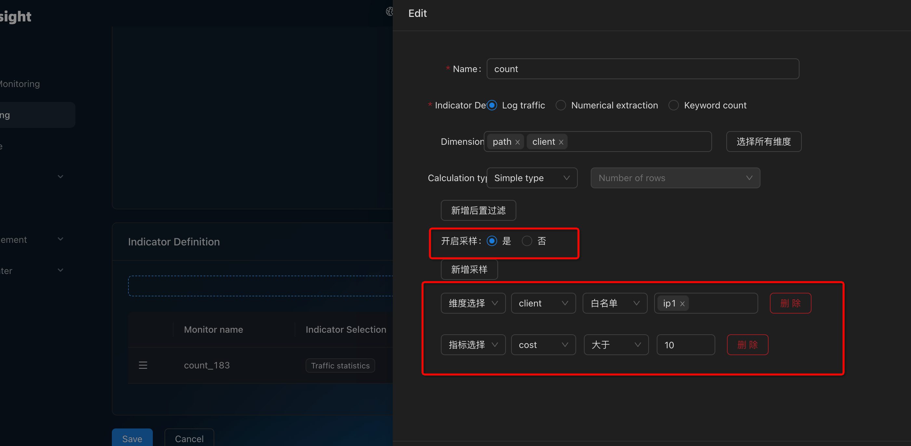
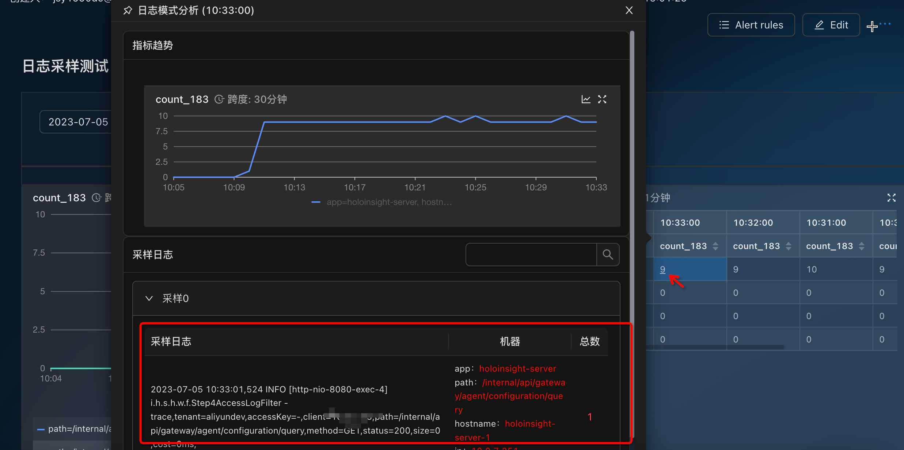

# Log sample

Log sampling is based on user-defined log monitoring and retains several logs that cause the indicator to be generated.
- For example, you now have a custom monitor with the following metrics:
    - time=2023-05-29 16:01:00 
    - dim={"code":500, "url": "www.example.com"}
    - value=2
- There are now two logs that cause this indicator to be generated. You now want to keep up to one such log.

  ```2023-05-29 16:01:03 xxxxxLONG_TRACE_IDxxxxxxx code=500 url=www.example.com reason= long long timeout```


### Config
#### Step 1 : EDIT
When configuring counters, add sampling conditions to perform log sampling



#### Step 2 : VIEW
Placing the mouse over the number brings up the sampling event.



### Config Meta

Add the logSamples field in select, based on a normal custom log monitoring configuration.

````
{
  "select": {
    "values":[...]
    # if logSamples == nil or !enabled , indicates that sampling is not started
    "logSamples": {
      "enabled" true,
      "where": {...满足该where条件的日志才会被采样...},
      "maxCount": 10, # 单机最多采样10条, 因为我们只能做到单机粒度, 建议暂时别开放给用户去配置, 设置为1就行了
      "maxLength": 4096, 日志如果超过4096, 会被截断
    }
  }
}
````
### Query Data

Logs are stored in: **${metricName}__logsamples_**, Its value is a json string with the following format.
````
{
  "samples": ["line1", "line2", "line3"],
  "maxCount": 10
}
````
#### Case1 : Query Server
````
# REQUEST
curl -l -H "Content-type: application/json"  -X POST http://127.0.0.1:8080/cluster/api/v1/query/data -d'{"tenant":"aliyundev","datasources":[{"start":1686733260000,"end":1686733320000,"name":"a","metric":"count_logsamples","aggregator":"none"}],"query":"a"}'
# RESPONSE

{
  "results": [{
    "metric": "a",
    "tags": {
      "app": "holoinsight-server",
      "path": "/webapi/meta/queryByTenantApp",
      "hostname": "holoinsight-server-0",
      "workspace": "default",
      "pod": "holoinsight-server-0",
      "ip": "ip1",
      "namespace": "holoinsight-server"
    },
    "points": [{
      "timestamp": "1686733260000",
      "strValue": "{\"maxCount\":1,\"samples\":[{\"hostname\":\"\",\"logs\":[[\"2023-06-14 17:01:51,745 INFO [http-nio-8080-exec-1] i.h.s.h.w.f.Step4AccessLogFilter - trace,tenant\u003daliyundev,accessKey\u003d-,client\u003d100.127.133.174,path\u003d/webapi/meta/queryByTenantApp,method\u003dPOST,status\u003d200,size\u003d9827,cost\u003d3ms,\"]]}]}"
    }]
  }]
}
````

#### Case2 : Query App
````
# REQUEST
curl -l -H "Content-type: application/json"  -X POST http://127.0.0.1:8080/cluster/api/v1/query/data -d'{"tenant":"aliyundev","datasources":[{"start":1686733260000,"end":1686733320000,"name":"a","metric":"count_logsamples", "groupBy":["app"], "aggregator":"sample"}],"query":"a"}'

# RESPONSE
{
  "results": [{
    "metric": "a",
    "tags": {
      "app": "holoinsight-server"
    },
    "points": [{
      "timestamp": "1686733260000",
      "strValue": "{\"samples\":[{\"hostname\":\"holoinsight-server-0\",\"logs\":[[\"2023-06-14 17:01:51,745 INFO [http-nio-8080-exec-1] i.h.s.h.w.f.Step4AccessLogFilter - trace,tenant\u003daliyundev,accessKey\u003d-,client\u003d100.127.133.174,path\u003d/webapi/meta/queryByTenantApp,method\u003dPOST,status\u003d200,size\u003d9827,cost\u003d3ms,\"]]}],\"maxCount\":1}"
    }]
  }]
}
````

### Resource Evaluation

Originally, only one float64/double value was needed for each dimension, but now there are several additional sample logs,
which are obviously much larger than the data (a 1KB log is 128 times more expensive than a double!).
Therefore, the pressure on the database will be much greater.
It is recommended to configure **_sampleWhere_** properly, such as sampling only **_error_** cases
